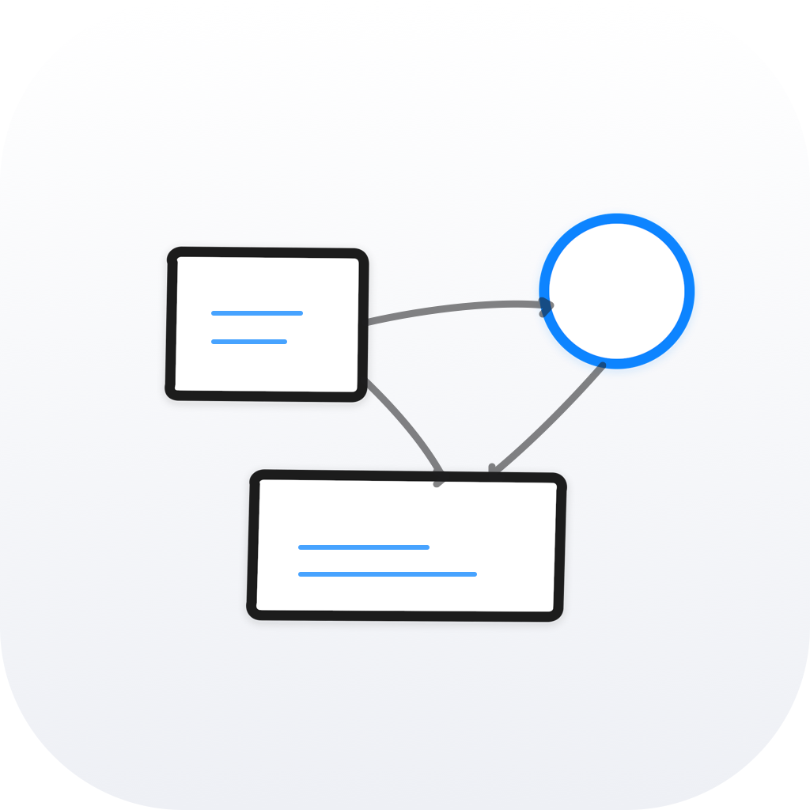

<div align="center">




<!-- TODO: hero GIF showing paste → diagram in motion -->

Slate is a standalone Mac app for paste-driven whiteboard brainstorming with Claude. Drop in a paragraph, an abstract, an image, or a PDF — watch the agent draw an explanatory diagram on a live Excalidraw canvas you can edit alongside.

For now: macOS + Claude Code subscription. Windows, Linux, Codex, and Gemini support coming soon.

[](https://github.com/ashryaagr/slate/releases/latest)
[](#install)
[](./LICENSE)
[](https://github.com/ashryaagr/slate)
[](https://github.com/ashryaagr/Fathom)

### Install

```bash
curl -fsSL https://raw.githubusercontent.com/ashryaagr/slate/main/install.sh | bash
```

*Apple Silicon · adds a `slate` launcher · no Gatekeeper prompt*

Prefer drag-to-Applications? [Get the Mac DMG →](./docs/INSTALL.md#option-b--dmg)

[Documentation](https://ashryaagr.github.io/slate/) · [Install guide](./docs/INSTALL.md) · [How it works](#how-it-works) · [Principles](./docs/PRINCIPLES.md) · [Methodology](./docs/methodology/index.md) · [Build from source](#build-from-source) · [All releases](https://github.com/ashryaagr/slate/releases)

</div>

---

## Built alongside Fathom

> I'm [Ashrya](https://github.com/ashryaagr), an AI scientist. While building [Fathom](https://github.com/ashryaagr/Fathom) — a research-paper reader with a per-paper whiteboard tab — it became clear that the whiteboard surface was useful on its own. People kept asking if they could paste *anything* into it: slide decks, code architectures, photos of a meeting whiteboard. So I extracted the same component into a standalone Mac app — and that's Slate.

There's nothing to sign up for, no subscription, no account. If you already pay for [Claude](https://claude.com/product/overview), you have everything Slate needs. The same component also ships as `fathom-whiteboard` on npm — the in-paper whiteboard tab inside Fathom is the same React component you can embed inside your own Electron / web app.

## What it feels like

Open Slate. Paste a paper abstract, a code architecture description, a screenshot of a system diagram, or a whole PDF. Hit return. Claude reads what you gave it and starts drawing on the canvas — boxes, arrows, labels, evidence callouts — while you watch. When the diagram lands, you can edit it directly: move things around, rewrite labels, add your own annotations. Type into the chat to refine: *"add the loss equation under the training loop", "show what happens when the cache misses"*. Each refinement is grounded in what's already on the canvas plus what you originally pasted. Close the app, reopen it tomorrow, the canvas is still there.

## What makes it different

- **The canvas is live, not a generated image.** Slate doesn't return a PNG. The agent draws on a real Excalidraw canvas — same primitives the open-source editor uses — so anything Claude draws, you can edit.
- **Grounded in what you paste.** No retrieval, no embeddings, no general-purpose web lookup. Slate hands the agent your pasted content and a single MCP server (`excalidraw-mcp`) and asks it to draw what's actually there. If something's wrong, you can see why by reading the same content the agent did.
- **Paste anything.** Markdown text, plain text, PDF files, images of slides or whiteboards. The agent handles each type natively — there's no "convert to text first" step that loses structure.
- **Available two ways.** Standalone Mac app for paste-driven brainstorming, OR an npm package (`fathom-whiteboard`) you embed inside your own Electron / web app as a `<Whiteboard>` React component. Same pipeline either way.

## Install

Slate's primary install path is the terminal:

```bash
curl -fsSL https://raw.githubusercontent.com/ashryaagr/slate/main/install.sh | bash
```

The script downloads the app, extracts to `/Applications`, clears the `com.apple.quarantine` xattr (so Gatekeeper doesn't ask for approval on first launch), ad-hoc re-signs, and drops a `slate` launcher at `~/.local/bin/slate` so you can `slate` from any terminal. Same script handles updates — re-run it or type `slate update`.

Want to read it before piping it to bash? [It's here](./install.sh) — about 230 lines.

Once installed:
```bash
slate                    # open Slate
slate update             # pull the latest version
slate --version          # print the installed version
slate uninstall          # remove Slate
```

### Prefer a drag-to-Applications install?

Download the Mac DMG: [`Slate-arm64.dmg`](https://github.com/ashryaagr/slate/releases/latest/download/Slate-arm64.dmg). The [install guide](./docs/INSTALL.md#option-b--dmg) walks you through the one-time Gatekeeper approval that DMG users see on first launch. Both paths converge on the same `Slate.app`.

Intel Macs aren't shipped in v0.1.x — build from source if you need x64 today (see below).

### Embedding inside another app?

Slate's whiteboard component is also published on npm as `fathom-whiteboard`:

```bash
npm install fathom-whiteboard
```

Documentation for the embedded path is in [Build from source](#build-from-source).

## Prerequisites

For now: macOS + Claude Code subscription. Windows, Linux, Codex, and Gemini support coming soon.

Slate runs the agent through the [Claude Agent SDK](https://github.com/anthropics/claude-agent-sdk-typescript), which wraps the Claude Code CLI. You'll need:

- [ ] **macOS on Apple Silicon** for the standalone app. The npm package itself is platform-agnostic.
- [ ] **Claude Code CLI installed** (`claude` on your `$PATH`).
   ```bash
   curl -fsSL https://claude.ai/install.sh | sh
   which claude   # should print something
   claude --version
   ```
- [ ] **Claude Code signed in.** Slate uses your existing Claude subscription through the CLI — no API keys.
   ```bash
   claude /login
   ```

If `claude` isn't on `$PATH` when Slate launches, the app surfaces the exact command to run. Re-launch and continue.

## How it works

```
   You paste content (text / PDF / image)
   │
   ├─► Slate hands the content + a system prompt to Claude (Agent SDK)
   │     system prompt = the coleam excalidraw SKILL + a Slate suffix
   │     allowed tools  = mcp__excalidraw__read_me + mcp__excalidraw__create_view
   │
   ├─► Claude calls read_me to inspect the current canvas
   │
   ├─► Claude emits an Excalidraw scene via create_view
   │     (boxes, arrows, labels, callouts — drawn while you watch)
   │
   └─► The scene streams to the local canvas in your window.
          Edit directly, or type a refinement into the chat.
          The next agent turn sees your edits + the same source content.
```

Two MCP tools, one or two agent turns, one elements array out. The whole pipeline is in [`src/pipeline.ts`](./src/pipeline.ts) — about 400 lines.

The hard part isn't the pipeline: it's the system prompt. Slate uses [coleam00's excalidraw-diagram-skill](https://github.com/coleam00/excalidraw-diagram-skill) verbatim — a 24KB design playbook that teaches the model what makes a diagram a *visual argument* (the Isomorphism Test, evidence artefacts, the bad-vs-good comparison table). The pipeline's only job is to deliver that playbook intact and stay out of the agent's way.

For the long-form write-up of why this shape replaced the elaborate pre-pivot pipeline (custom MCP wrapper, template library, Pass 1 / Pass 2 / Pass 2.5 visual critic loop, ~3,000 LOC), see [docs/methodology/index.md](./docs/methodology/index.md).

## Your data stays yours

Slate runs entirely on your machine. No telemetry. No analytics. No accounts. No server ever sees your pasted content, your canvas, or your conversations with Claude. The only network calls are your own Claude Code CLI talking to Anthropic on your behalf, and the app's release-checker pinging GitHub for new versions.

Per-session canvas state lives under `~/Library/Application Support/Slate/sessions/last/` — delete that folder any time to wipe local state without touching anything else.

## Using inside your company

- **Zero telemetry.** Slate doesn't phone home about what you paste or what diagrams you draw. The only outbound traffic is the Claude CLI talking to Anthropic on your existing subscription.
- **Open source, MIT.** Read the source. Audit the prompts. Build it yourself.
- **Build from source if you can't trust a downloaded binary.** The whole app builds with `npm install && npm run dist:mac` — no Apple Developer account, no notarisation flow required.
- **Uses your existing Claude subscription.** Whatever your team already pays for Claude works for Slate; no new procurement.

Most whiteboard tools want a vendor relationship. Slate is a Mac app you compiled yourself.

## Methodology

[docs/methodology/index.md](./docs/methodology/index.md) is the engineering write-up of how Slate's pipeline works: how the SKILL prompt is delivered, what the `allowedTools` lock-down does, why the hosted MCP endpoint is the default, and what the cost profile looks like in practice (about $0.95/paper for generation, $0.10–$0.30 per refinement turn).

## Design principles

The product was built on a small set of principles. [docs/PRINCIPLES.md](./docs/PRINCIPLES.md) spells them out — read it before proposing changes.

Highlights:
1. **The canvas is the answer.** Don't return text-about-a-diagram; return the diagram.
2. **Use the subject's own vocabulary.** Anything the agent invents in place of a real name is a bug.
3. **Repetition without reason is noise.** Two parts that look alike must reflect a real similarity in the subject.
4. **The scene is editable, always.** What the agent draws, the user can change.
5. **Persist by default.** Once the user has paid the API cost to generate a diagram, regenerating it because we forgot to save is a design failure.

## Build from source

```bash
git clone https://github.com/ashryaagr/slate.git
cd slate
npm install
npm run app:build         # bundle the Electron entry + renderer
npm run app               # launch in dev mode
npm run dist:mac          # produce release/Slate-arm64.{dmg,zip}
```

Embed inside your own host:

```ts
import { generateWhiteboard, refineWhiteboard } from 'fathom-whiteboard';
import { Whiteboard, type WhiteboardHost } from 'fathom-whiteboard/react';

const host: WhiteboardHost = {
  loadScene: () => myIpc.invoke('whiteboard:get'),
  saveScene: (scene) => myIpc.invoke('whiteboard:save', scene),
  generate: (cb) => myIpc.streamingInvoke('whiteboard:generate', cb),
  refine: (scene, instruction, cb) =>
    myIpc.streamingInvoke('whiteboard:refine', { scene, instruction }, cb),
};

<Whiteboard host={host} />
```

Full host-contract documentation in [`src/Whiteboard.tsx`](./src/Whiteboard.tsx).

## Architecture

```
slate/
├── src/
│   ├── pipeline.ts        Claude Agent SDK + excalidraw-mcp wiring
│   ├── Whiteboard.tsx     React component + WhiteboardHost interface
│   ├── mcp-launcher.ts    hosted endpoint resolution + local spawn
│   ├── skill.ts           coleam SKILL.md as a constant
│   └── SKILL.md           source-of-truth copy of the SKILL
├── app/
│   ├── main.ts            Electron main process (Slate-only)
│   ├── preload.ts         contextBridge surface (window.wb)
│   └── renderer/          minimal React shell hosting <Whiteboard>
├── docs/
│   ├── INSTALL.md         Mac install walkthrough
│   ├── PRINCIPLES.md      design rules (read before changing things)
│   ├── methodology/       pipeline write-up
│   │   └── index.md
│   └── index.md           docs landing page
├── vendor/excalidraw-mcp  cloned at install time; gitignored
└── electron-builder.config.cjs   Mac packaging
```

Core dependencies: Electron, React 18, `@excalidraw/excalidraw`, `@anthropic-ai/claude-agent-sdk`, esbuild, electron-builder.

## Why this works (research backing)

Slate is grounded in a small set of cognitive-science results. Citations are listed honestly — where the project's earlier notes overstated an effect size, this section uses the conservative form.

- **Diagrams aid reasoning.** Larkin & Simon (1987) showed that diagrammatic representations make information *explicit through spatial indexing* that sentential representations leave implicit, reducing search and inference cost. (*Why a Diagram is (Sometimes) Worth Ten Thousand Words*, Cognitive Science 11(1).) Slate's whiteboard is a reasoning surface, not decoration: relations are placed in 2D space the reader can scan parafoveally instead of being chased through prose.

- **Element interactivity drives cognitive load.** Sweller (2010) reformulates intrinsic cognitive load as the count of *interacting* elements a learner must hold simultaneously, not the count of elements. (*Element Interactivity and Intrinsic, Extraneous, and Germane Cognitive Load*, Educational Psychology Review 22(2).) Implication for Slate's layout: the diagrams' shape should match the subject's actual coupling structure — boxes that interact get drawn near each other, boxes that don't get separated by whitespace.

- **Self-explanation.** Chi et al. (1989) showed that learners who articulate the connection between an example and the underlying principle outperform those who don't. (*Self-Explanations: How Students Study and Use Examples in Learning to Solve Problems*, Cognitive Science 13(2).) Replicated in Chi et al. 1994. Slate operationalises this: the user types the prompt — the act of articulating what they want explained is itself the work that produces understanding. There is no "auto-explain" path.

- **Graphic organisers help, modestly.** Luiten, Ames & Ackerson's (1980) meta-analysis of 135 studies found a *small but reliable* facilitative effect of advance organisers on learning and retention. (*A Meta-analysis of the Effects of Advance Organizers on Learning and Retention*, American Educational Research Journal 17(2).) Slate's whiteboard is a graphic structural overview of pasted content — it helps, but Slate doesn't sell it as a giant learning multiplier.

## See also

- [**Fathom**](https://github.com/ashryaagr/Fathom) — research-paper reader with the same whiteboard tab inside it. Use Fathom when you want to read and zoom into a paper; use Slate when you want to paste anything (slides, code, screenshots) and get a diagram. The same `fathom-whiteboard` npm package powers both.

## More tools for researchers

- [**papers-we-love/papers-we-love**](https://github.com/papers-we-love/papers-we-love) — curated directory of computer-science papers organised by topic, with links to canonical PDFs. The canonical "papers worth reading" map.
- [**writing-resources/awesome-scientific-writing**](https://github.com/writing-resources/awesome-scientific-writing) — academic writing tools beyond LaTeX (Markdown editors, Zotero, Pandoc, Quarto, Jupyter Book). Pairs naturally with Slate, which sits at the input end of the same workflow.
- [**josephmisiti/awesome-machine-learning**](https://github.com/josephmisiti/awesome-machine-learning) — ML frameworks, libraries and tools by language. Worth noting: the maintainer flagged in early 2026 that LLM-generated PRs have made the list "no longer fun or manageable," so contributions have slowed.

## Contact

If you like the project — drop a note to ashryaagr@gmail.com. I read every message.

## Contributing

Issues and PRs welcome. Before opening a PR, check [docs/PRINCIPLES.md](./docs/PRINCIPLES.md) — if your change contradicts a principle there, the principle wins unless you can articulate why it should change.

For bug reports, the DevTools console log (Cmd+Option+I in the running app) is more useful than a screenshot — every subsystem emits `[Slate …]` or `[fathom-whiteboard …]` lines so we can trace a failure end-to-end.

## License

MIT — see [LICENSE](./LICENSE).
